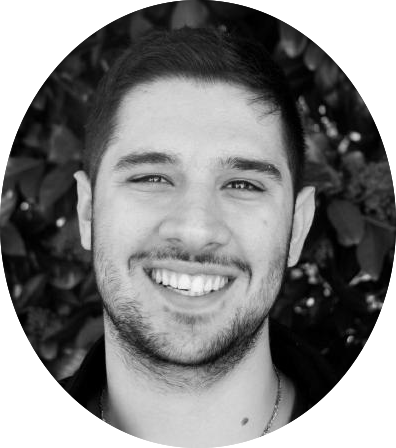

   

  Name:  &nbsp;&nbsp;&nbsp;&nbsp;&nbsp; Stavros Tsentemeidis 
 

  Birth Date:  &nbsp;&nbsp;&nbsp;&nbsp;&nbsp;  09/05/1996 

 Country of Origin: &nbsp;&nbsp;&nbsp;&nbsp;&nbsp;  Greece 

 Ocupation: &nbsp;&nbsp;&nbsp;&nbsp;&nbsp;  Master Degree Student 

 Languages: &nbsp;&nbsp;&nbsp;&nbsp;&nbsp;  Greek, English, Spanish 

 Hobbies:  &nbsp;&nbsp;&nbsp;&nbsp;&nbsp;  Love solving puzzles and enjoy going to escape rooms. 

I really love puzzles and I want to expand this love to the business problems and learn    
how to solve them effectively through the power of Data & Analytics.    
I may not be a coding expert, but through my Master in IE i will succesfully gain deep knowledge in analytical tools like R, PYTHON and SPARK.       
My theoretical and practical experience through the program will be tested constantly, under Datathons and group analytical projects based on kaggle competitions and challenges.       
I excelled at the Greek National Exams and ranked 1st in my department.    
Became the leader of a successful Marketing Team, leading them to a great performance (2nd overall) at the FSAE International competition.   

